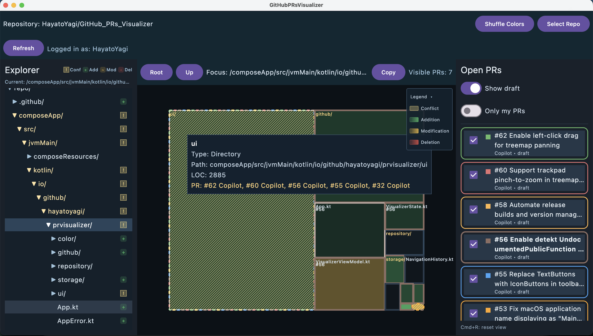

# PRs Visualizer for GitHub

[🇬🇧 English](./README.md) | 🇯🇵 日本語

GitHubリポジトリのオープンなプルリクエストを視覚的に把握するためのデスクトップアプリケーションです。WinDirStatやWizTreeのようなディスク容量可視化ツールにインスパイアされたツリーマップ形式で、どのファイルやディレクトリで開発が進行中かを一目で確認できます。

## 🖼️ スクリーンショット


*注: このスクリーンショットは開発中ビルドの画面であり、今後のリリース版とは異なる場合があります。*

## 🎯 このツールを使って欲しい人

### チーム開発をしている方
- 複数人で同時に開発していて、**コンフリクトが起きそうな場所を事前に把握**したい
- PRレビューの優先順位を決めたい
- コードベースのどこで活発に開発が行われているかを把握したい

### AI Agentを活用している方
- AIエージェントに並列でPRを作らせている時に、**作業範囲を監視**したい
- 大量のPRに対して影響範囲を視覚的に確認し、レビュー優先度を決めたい

### アーキテクチャの改善を検討している方
- 一箇所で頻繁にコンフリクトが起こっている場合、**アーキテクチャの見直しのきっかけ**を得られる
- 適切にモジュール化・ファイル分割が行われているかを視覚的に確認したい

## ✨ 主な機能

- オープンなPRのファイル/ディレクトリへの変更をTreemapで可視化
- 変更の種別（追加・編集・削除）を色で表現
- 複数のPRが同じファイルを変更している場合に警告
- PRの表示/非表示を個別に切り替えられるサイドバー（Draft除外も可能）

## 🚀 使い方

### 前提条件
- Java 17以上がインストールされていること

### 起動方法

#### macOS / Linux
```bash
./gradlew :composeApp:run
```

#### Windows
```bash
.\gradlew.bat :composeApp:run
```


## 🔧 技術スタック

Kotlin と [Compose Multiplatform](https://www.jetbrains.com/compose-multiplatform/)（Compose for Desktop）で構築されています。

## 🛠️ 開発

### コードスタイル

このプロジェクトは、Kotlinコードのフォーマットとスタイルチェックに [ktlint](https://github.com/pinterest/ktlint) を使用し、静的コード解析に [detekt](https://detekt.dev/) を使用しています。

コードスタイルをチェックする場合:
```bash
./gradlew ktlintCheck
```

コードを自動フォーマットする場合:
```bash
./gradlew ktlintFormat
```

静的コード解析を実行する場合:
```bash
./gradlew detekt
```

## 📦 ビルド済みアプリの配布

GitHubのリリースページから、ビルド済みのアプリケーションをダウンロードできます：
- [Releases](https://github.com/HayatoYagi/GitHub_PRs_Visualizer/releases)

各プラットフォーム用のインストーラーが利用可能です：
- macOS: `.dmg` ファイル
- Windows: `.msi` ファイル
- Linux: `.deb` ファイル

### 開発者向け: リリースプロセス

リリースプロセスの詳細については、[docs/RELEASE.md](./docs/RELEASE.md) を参照してください（英語）。

## 🔗 参考

詳細な仕様やデザインドキュメントは[docsディレクトリ](./docs)をご覧ください。
