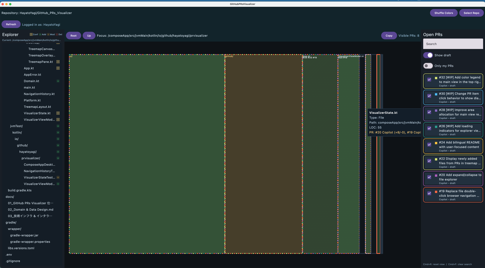

# GitHub PRs Visualizer

🇬🇧 English | [🇯🇵 日本語](./README.ja.md)

A desktop application for visually understanding the state of open pull requests in GitHub repositories. Inspired by disk space visualizers like WinDirStat and WizTree, it uses a treemap visualization to show at a glance which files and directories are under active development.

## 🖼️ Screenshot


*Note: This screenshot shows a development build UI and may differ from future releases.*

## 🎯 Who Should Use This Tool

### For Team Development
- Working with multiple developers simultaneously and want to **identify potential conflicts early**
- Need to prioritize PR reviews
- Want to understand where active development is happening in the codebase

### For AI Agent Users
- Using AI agents to create PRs in parallel and want to **monitor their work ranges**
- Need to visually assess the impact of numerous PRs to prioritize reviews

### For Architecture Improvement
- Frequent conflicts in one area can be a **trigger for architecture review**
- Want to visually verify if your code is properly modularized and files are appropriately divided

## ✨ Key Features

- Treemap visualization of file/directory changes across open PRs
- Color-coded by change type (addition, modification, deletion)
- Conflict warnings when multiple PRs touch the same file
- Sidebar to toggle PR visibility individually or filter out drafts

## 🚀 Getting Started

### Prerequisites
- Java 17 or higher installed

### Running the Application

#### macOS / Linux
```bash
./gradlew :composeApp:run
```

#### Windows
```bash
.\gradlew.bat :composeApp:run
```


## 🔧 Tech Stack

Built with Kotlin and [Compose Multiplatform](https://www.jetbrains.com/compose-multiplatform/) (Compose for Desktop).

## 🛠️ Development

### Code Style

This project uses [ktlint](https://github.com/pinterest/ktlint) for Kotlin code formatting and style checking, and [detekt](https://detekt.dev/) for static code analysis.

To check code style:
```bash
./gradlew ktlintCheck
```

To automatically format code:
```bash
./gradlew ktlintFormat
```

To run static code analysis:
```bash
./gradlew detekt
```

## 📦 Future Distribution

In the future, we plan to distribute pre-built applications through GitHub release tags, making it easy to use without building locally.

## 🔗 Documentation

For detailed specifications and design documents, see the [docs directory](./docs).
